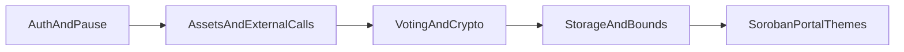

# Tansu Soroban Smart Contract Security Assessment

| Field | Value |
| --- | --- |
| Target | Tansu on-chain contract (`contracts/tansu`, crate `tansu` 2.0.0) |
| On-chain version identifier | `version()` returns `2` |
| Toolchain | Rust edition 2024; workspace `soroban-sdk` 26.0.0 |
| Repository revision | `3d0e33b82dfe866b98f23d34b1b4a9f0f7b5f7a5` |
| Assessment date | May 2026 |
| Assessment type | Independent internal security assessment |

---

## Executive Summary

This assessment reviews the Tansu Soroban contract in `contracts/tansu` from the current source tree. The contract implements project registration, commit tracking, membership and badges, public and anonymous DAO voting, optional token-weighted proposals, conflict-of-interest controls, NQG-based voting weight for one configured project, collateral handling, outcome hooks, emergency pause, and multisig upgrade administration.

The assessment identified several governance-integrity assumptions that should be explicit before external review. In particular, anonymous voting commitments are accepted without an on-chain proof that each encrypted vote represents exactly one valid choice. This is mitigated by maintainer-only execution and by the maintainer `remove_vote`/slashing path, but those controls are operational and reactive rather than cryptographic enforcement.

### Finding Counts

| Severity | Count |
| --- | ---: |
| Critical | 0 |
| High | 0 |
| Medium | 1 |
| Low | 3 |
| Informational | 3 |

### Highest-Risk Conclusions

- **Anonymous voting relies on off-chain detection of malformed ballots.** The contract checks commitment shape and curve decoding, but it does not enforce one-hot or bounded vote semantics. A voter can commit to multiple outcomes or arbitrary numeric buckets. Maintainers can remove and slash malicious votes before execution if detected.
- **Token-based voting intentionally permits proposer-selected token contracts.** This gives proposals flexibility, but reviewers and maintainers must treat the selected token as part of proposal review and revoke/slash malicious proposals when the token contract is not trusted.
- **Project maintainership is a strong trust boundary.** A current maintainer can replace the maintainer list, including with an empty or attacker-controlled list.
- **NQG is an operationally scoped integration.** It is configured by admins for a single intended project and is expected to be set before badge voting is used in that deployment.

The contract has strong explicit authorization patterns in many paths, bounded proposal/vote collections, release overflow checks, and a clear administrative upgrade path. The findings below should be addressed or formally accepted before submitting the system to the audit bank.

---

## Scope

### In Scope

All Rust source files in `contracts/tansu/src`:

| File | Role |
| --- | --- |
| `contracts/tansu/src/lib.rs` | Contract traits, shared authorization helper, contract validation helper |
| `contracts/tansu/src/contract_tansu.rs` | Constructor, pause, admin configuration, external contract registration, upgrades |
| `contracts/tansu/src/contract_versioning.rs` | Project registration, domain integration, config updates, commits, sub-projects |
| `contracts/tansu/src/contract_membership.rs` | Member registry, badges, voting weight, NQG integration |
| `contracts/tansu/src/contract_dao.rs` | Proposal creation, voting, execution, anonymous commitments, COI, vote removal |
| `contracts/tansu/src/contract_migration.rs` | Admin pagination migration |
| `contracts/tansu/src/types.rs` | Storage keys, proposal/vote/member/admin data types |
| `contracts/tansu/src/errors.rs` | Contract error enum |
| `contracts/tansu/src/events.rs` | Contract event definitions |
| `contracts/tansu/src/tests/*` | Test coverage used as behavioral evidence |

### Out of Scope

- `contracts/scf-membership`.
- Off-chain clients, wallets, indexers, deployment scripts, key management, and operational runbooks.
- Bytecode review of `contracts/domain_current.wasm`.
- Formal verification of BLS12-381 group assumptions or Soroban host semantics.
- Full review of every report downloadable from the Soroban Security Portal.

---

## Methodology

The review used source-level manual analysis, STRIDE-style threat modeling, Soroban-specific checklist themes, and test inspection. The reviewer assumed attackers can choose all public function arguments, deploy contracts that mimic expected token/outcome interfaces, observe pending transactions, and interact with the contract unless a path requires valid `require_auth`.

### Passes Performed



- **Authorization and pause:** Admin, maintainer, proposer, voter, and public helper paths were mapped against `require_auth`, `auth_admin`, `auth_maintainers`, and `require_not_paused`.
- **Assets and external calls:** Collateral flows, token voting, domain calls, NQG calls, outcome hooks, and upgrade WASM updates were reviewed for validation and failure behavior.
- **Voting and crypto:** Public tallies, anonymous commitments, aggregate proofs, vote removal, and execution-time tally checks were reviewed.
- **Storage and bounds:** Typed storage keys, pagination, vote limits, conflict-of-interest lists, migration, and TTL assumptions were reviewed.
- **Soroban ecosystem themes:** The review cross-checked against common Soroban risks: missing authorization, arbitrary contract calls, token transfer assumptions, unbounded storage, TTL/archival, arithmetic, and upgrade access control.

### Soroban Security Portal Cross-Check

The public [Soroban Security Portal reports page](https://sorobansecurity.com/reports) was reachable and lists recent reports including RedStone Stellar Connector, Lydia Labs HiYield, Spiko, zkCrossDex, Trustless Work, Scaffold Registry, Blend, Stellar Contracts Library, and others. The [vulnerabilities page](https://sorobansecurity.com/vulnerabilities) appeared to load entries dynamically during this assessment, so this report does **not** cite invented vulnerability IDs. The portal and public Soroban security guidance were used as a theme checklist, not as a source of specific undisclosed findings.

---

## Key Assumptions and Limits

- **Soroban transaction atomicity:** This report assumes Soroban rolls back state and token side effects on panic. This is important because `execute` performs refunds before anonymous proof validation and outcome invocation.
- **Constructor semantics:** This report assumes the Soroban constructor path cannot be called more than once after deployment.
- **External domain contract:** The imported domain WASM interface is used by Tansu, but the domain bytecode was not audited here.
- **Off-chain anonymous voting:** Encryption, decryption, key custody, and voter UI correctness are off-chain. The contract stores a `public_key`, encrypted strings, and commitments, but it does not verify encryption correctness.
- **Maintainer trust:** Maintainers can execute proposals, manage project configuration, set badges, configure anonymous voting, remove votes, and manage conflict-of-interest lists. This is a central trust assumption for each project.
- **NQG setup and behavior:** The deployment model assumes admins configure NQG in the correct order before the single NQG-backed project uses badge-weight paths. If the NQG call fails, `get_nqg` returns zero voting power; this is treated as an accepted fail-closed behavior for the NQG-backed project.
- **TTL and archival cost:** Persistent storage TTL is not actively extended by the contract. The accepted operational model relies on Soroban archival auto-restore, with restoration fees borne by callers when archived entries are accessed.

---

## Architecture Overview

### Roles

| Role | Main powers |
| --- | --- |
| Admin | Pause/unpause, set domain/collateral/NQG contracts, propose/approve/finalize upgrades, run pagination migration |
| Maintainer | Register/update project state, commit hashes, manage badges, configure anonymous voting, execute/revoke proposals, remove votes, manage conflicts |
| Proposer | Create proposals by locking collateral |
| Voter | Vote once per proposal by locking XLM or proposal token weight |
| Public caller | Read getters, build commitments, run proof helper |

### External Integrations

| Integration | Validation in current code | Security relevance |
| --- | --- | --- |
| Soroban Domain | Stored `Contract`; optional WASM hash validation via `validate_contract` | Project name ownership and registration |
| Collateral SAC | Stored `Contract`; `wasm_hash` may be `None` for native SAC | XLM proposal/vote collateral |
| NQG | Stored global `Contract`; WASM hash validation if configured | Alternate voting weight source for one admin-configured project |
| Token-based proposals | Proposer-supplied `Address`; no allowlist or validation | Voting power source for token proposals |
| Outcome contracts | Proposer-supplied `Address`, function, args; no allowlist or validation | Optional post-execution hooks |

---

## Detailed Security Analysis

### Authorization and Access Control

Admin paths call `auth_admin`, which performs `admin.require_auth()` and checks membership in stored `AdminsConfig`. Project maintainer paths generally call `auth_maintainers`, which performs `maintainer.require_auth()`, loads the project, and checks the maintainer list.

State-changing functions with pause checks include `anonymous_voting_setup`, `create_proposal`, `vote`, `execute`, `remove_vote`, `revoke_proposal`, conflict-of-interest updates, versioning mutations, member mutations, badge updates, sub-project updates, and pagination migration. Admin actions intentionally remain available while paused for emergency recovery.

### Initialization and Upgrades

`__constructor` sets the pause flag, initializes a one-admin `AdminsConfig`, and then calls `pause(..., true)`, causing the contract to start paused. Upgrade flow is admin-gated and uses `propose_upgrade`, `approve_upgrade`, and `finalize_upgrade`. `finalize_upgrade` requires current-admin threshold approval and a 24-hour `TIMELOCK_DELAY` before `update_current_contract_wasm`.

The current release profile enables `overflow-checks = true`, reducing integer overflow risk in production builds.

### Project Versioning and Membership

Project registration derives keys as `keccak256(name)`, checks Soroban Domain ownership/registration, stores project config, and appends to project pagination. `update_config` lets any current maintainer replace the project config and maintainer list. This is a governance trust model and is carried as L-03 because an empty or captured maintainer set can freeze maintainer-gated project operations.

Membership is self-service for `add_member` and `update_member`. Badge assignment is maintainer-only. Badge voting weight is calculated in `get_max_weight`, except for the single admin-configured NQG project key.

### Public Voting

Public votes are represented by `VoteChoice::{Approve, Reject, Abstain}` and a `u32` weight. For badge proposals, the contract checks `weight <= get_max_weight`. For token proposals, it instead transfers `weight` units from the selected token contract and treats that transfer as the proposal's declared token-voting mechanism.

The result rule is supermajority-style:

- Approved if `approve > reject + abstain`.
- Rejected if `reject > approve + abstain`.
- Cancelled otherwise.

### Anonymous Voting

Anonymous voting uses three commitments per voter. The configured generators are derived with BLS12-381 `hash_to_g1` using fixed domain strings. Each commitment is intended to represent one tally bucket using:

```text
C_i = g * vote_i + h * seed_i
```

The contract enforces:

- Exactly three commitments.
- Exactly three encrypted vote strings and three encrypted seed strings.
- Each commitment decodes as a BLS12-381 G1 point.
- Voter address matches the authenticated voter.
- Badge-based `weight <= get_max_weight`, or token transfer for token-based votes.

The contract does **not** enforce:

- `vote_i` values are in `{0,1}`.
- Exactly one of the three buckets is selected.
- The encrypted strings correspond to the commitments.
- The stored `public_key` was used for encryption.
- A zero-knowledge proof that the committed vote is well formed.

This is the core of M-01.

### Collateral and Token Flow

Badge-based proposals lock fixed XLM-denominated collateral through the configured collateral contract. Token-based proposals lock only proposal collateral in XLM; voters lock `weight` units of the proposal token. On normal execution, proposal collateral and voter collateral/tokens are returned. On malicious revocation or maintainer vote removal, the affected collateral remains held by the contract by design.

Token-based voting is only meaningful if the selected token contract is trusted. The current code allows each proposal to choose any token address.

### Conflict of Interest and Vote Removal

Maintainers can add and remove conflict-of-interest addresses while the proposal is active. The list prevents future voting but does not automatically remove votes that were already cast. Existing votes can be removed through maintainer-only `remove_vote`, which also reverses stored tallies and slashes the removed voter’s collateral.

The conflict list has no explicit maximum length.

### Storage and TTL

The contract uses typed enum storage keys, reducing collision risk. Persistent storage is used for projects, members, votes, tallies, DAO pages, anonymous config, conflicts, and pagination; instance storage is used for admin/global configuration. The contract does not actively extend TTL for persistent entries. This is an accepted design choice: callers may pay Soroban auto-restore costs when accessing archived entries.

---

## Findings

### Summary Table

| ID | Severity | Title | Status |
| --- | --- | --- | --- |
| M-01 | Medium | Anonymous voting commitments do not enforce well-formed vote semantics | Open |
| L-01 | Low | Outcome contract targets are not validated or allowlisted | Open |
| L-02 | Low | Conflict-of-interest list is unbounded and only blocks future votes | Open |
| L-03 | Low | A maintainer can replace the maintainer set, including with an empty list | Open |
| I-01 | Informational | Public `proof()` helper relies on caller-supplied proposal metadata | Open |
| I-02 | Informational | Token-based voting uses proposer-selected token contracts by design | Open |
| I-03 | Informational | Pagination migration is non-idempotent and can duplicate project entries | Open |

---

### M-01: Anonymous Voting Commitments Do Not Enforce Well-Formed Vote Semantics

**Severity:** Medium

**Status:** Open

**Affected paths:**

- `contracts/tansu/src/contract_dao.rs`: `vote`, `build_commitments_from_votes`, `update_proposal_tallies`, `proof_from_aggregates`, `anonymous_execute`
- `contracts/tansu/src/types.rs`: `AnonymousVote`
- `contracts/tansu/src/tests/test_dao.rs`: anonymous DAO test using non-one-hot committed values

**Description:**

Anonymous voting accepts three BLS12-381 commitments and verifies that each commitment decodes as a G1 point. It does not verify that the hidden vote values are one-hot, bounded, or semantically equivalent to a single `Approve`, `Reject`, or `Abstain` choice. A malformed anonymous ballot can therefore vote on two outcomes at the same time, or assign larger numeric values than a single valid ballot would allow.

During execution, maintainers provide aggregate `tallies` and `seeds`. The contract checks whether:

```text
g * tally_i + h * seed_i == stored_aggregate_commitment_i
```

This proves only that the supplied aggregate opens the stored commitments. It does not prove that each individual voter contributed a valid ballot. The test suite demonstrates accepted non-one-hot values by constructing a vote from `[3, 1, 1]` and executing with aggregate tallies `[9, 3, 3]` for a voter weight of `3`.

**Impact:**

An anonymous voter can cast more voting influence than intended by committing values larger than a single-choice ballot or by committing to multiple outcomes. The badge or token weight cap applies as a scalar multiplier, but the hidden vote buckets themselves are unconstrained.

The impact is mitigated by two design controls: only maintainers can execute proposals, and maintainers can call `remove_vote` on active proposals to delete and slash malicious votes. Since `remove_vote` is permitted while a proposal remains `Active` even after the voting period ends, maintainers have an operational review window before execution. This lowers the severity from High to Medium, but does not remove the issue because malformed-ballot detection is off-chain and reactive.

**Recommendation:**

Document anonymous voting as requiring off-chain malformed-ballot detection until on-chain well-formedness is enforced. Options include:

- Add a zero-knowledge proof that each ballot is one-hot and bounded.
- Use the existing `remove_vote`/slashing path as an explicit operational control before execution.
- Restrict anonymous voting to trusted off-chain coordinators and document the review process.
- Replace the current anonymous vote representation with a scheme whose validity can be checked on-chain.
- Add tests that attempt oversized and multi-bucket anonymous votes and assert rejection after remediation.

---

### L-01: Outcome Contract Targets Are Not Validated or Allowlisted

**Severity:** Low

**Status:** Open

**Affected paths:**

- `contracts/tansu/src/types.rs`: `OutcomeContract`
- `contracts/tansu/src/contract_dao.rs`: `create_proposal`, `execute`

**Description:**

Proposal outcome hooks contain a target address, function symbol, and args. These are supplied at proposal creation and invoked during `execute` using `try_invoke_contract`. The target contract is not validated with a WASM hash, registry, or allowlist.

**Impact:**

A proposal can include unexpected or malicious post-execution calls. The risk is partially mitigated because only maintainers can execute proposals, and outcome calls occur after collateral refunds and status persistence in the same transaction. Nevertheless, the target trust boundary is not explicit.

**Recommendation:**

Add per-project or admin-managed outcome allowlists, or store expected WASM hashes with outcome descriptors.

---

### L-02: Conflict-of-Interest List Is Unbounded and Only Blocks Future Votes

**Severity:** Low

**Status:** Open

**Affected paths:**

- `contracts/tansu/src/contract_dao.rs`: `add_conflict_of_interest`, `remove_conflict_of_interest`, `get_conflict_of_interest`, `vote`
- `contracts/tansu/src/types.rs`: `ProjectKey::ConflictOfInterest`

**Description:**

Maintainers can append addresses to a proposal’s conflict-of-interest list. There is no explicit list length cap. Voting checks membership with a linear `contains`. Adding an address after it has already voted does not remove the existing vote.

**Impact:**

The list can grow large enough to increase voting cost. Maintainers pay to grow it, so this is mostly a project-governance or compromised-maintainer DoS risk. The “future votes only” behavior can also surprise users if they expect conflict marking to retroactively remove votes.

**Recommendation:**

Add a maximum COI list length and document whether COI marking is prospective only. If retroactive enforcement is desired, integrate with `remove_vote`.

---

### L-03: A Maintainer Can Replace the Maintainer Set, Including With an Empty List

**Severity:** Low

**Status:** Open

**Affected path:** `contracts/tansu/src/contract_versioning.rs`: `update_config`

**Description:**

`update_config` authorizes the caller as a current maintainer, then replaces `project.maintainers` with the caller-supplied vector. The function does not require the new maintainer list to be non-empty, preserve the caller, or satisfy a project-level quorum.

**Impact:**

A compromised or malicious maintainer can capture the project by replacing all maintainers, or can set an empty maintainer list. An empty list prevents future calls to maintainer-gated functions such as `execute`, `remove_vote`, `anonymous_voting_setup`, `set_badges`, `commit`, and `set_sub_projects`. Admins can still use admin-only controls such as pause and malicious proposal revocation, but they do not become project maintainers automatically.

This is assessed as Low because it is part of the current project-maintainer trust model, not an unauthenticated path.

**Recommendation:**

Document the single-maintainer update trust model. If stronger project governance is desired, require a non-empty maintainer list, preserve at least one existing maintainer, or route maintainer-list replacement through DAO approval or a multi-maintainer threshold.

---

### I-01: Public `proof()` Helper Relies on Caller-Supplied Proposal Metadata

**Severity:** Informational

**Status:** Open

**Affected path:** `contracts/tansu/src/contract_dao.rs`: `proof`

**Description:**

The public `proof()` helper receives a full `Proposal` argument and uses that argument for status, voting type, and proposal ID checks, while loading vote records from storage using the supplied `project_key` and `proposal.id`. Contract execution uses `proof_from_aggregates` instead, not this helper.

**Impact:**

The helper can be misused by clients if they pass stale or mismatched proposal objects. This does not directly affect `execute`, but it can produce confusing verification results for external tooling.

**Recommendation:**

Document `proof()` as a client helper, or change the API to load the canonical proposal from storage by `(project_key, proposal_id)`.

---

### I-02: Token-Based Voting Uses Proposer-Selected Token Contracts by Design

**Severity:** Informational

**Status:** Open

**Affected paths:**

- `contracts/tansu/src/contract_dao.rs`: `create_proposal`, `vote`, `execute`
- `contracts/tansu/src/types.rs`: `VoteData.token_contract`

**Description:**

`create_proposal` accepts `token_contract: Option<Address>` directly from the proposer and stores it in proposal data. If present, `vote` uses that address with `TokenClient::try_transfer` and treats successful transfer of `weight` units as the proposal's token-voting mechanism. There is no allowlist, admin token registry, or SAC validation for the proposal token.

This is treated as informational because arbitrary proposal content is already subject to maintainer review: maintainers can revoke malicious proposals, malicious proposals can be slashed, and only maintainers can execute final outcomes. The selected token contract should be considered part of the proposal payload that maintainers and voters review.

**Impact:**

If users or tooling assume that token-based proposals always use a canonical or trusted asset, they can misinterpret the result. A malicious token proposal should be revoked/slashed rather than executed. A hostile or paused token contract can also cause refund transfers in `execute` to fail, which would revert the execution transaction until maintainers intervene by removing the problematic vote or revoking the proposal.

**Recommendation:**

Document token-contract selection clearly in proposal UI and review procedures. If a project later wants token voting to mean a specific governance asset, add a per-project allowlist or configured voting token.

---

### I-03: Pagination Migration Is Non-Idempotent and Can Duplicate Project Entries

**Severity:** Informational

**Status:** Open

**Affected path:** `contracts/tansu/src/contract_migration.rs`: `add_projects_to_pagination`

**Description:**

`add_projects_to_pagination` appends project keys for existing project names and increments `TotalProjects` for every matching name. It does not deduplicate against existing pagination pages. The test suite explicitly covers that duplication is allowed.

**Impact:**

Admin misuse can duplicate project entries in pagination output and inflate `TotalProjects` relative to the number of unique projects. This affects listing integrity and off-chain consumers that treat pagination entries as unique. It does not overwrite project state or grant unauthorized access.

**Recommendation:**

Treat the migration function as a one-time operational tool. If it will remain callable long term, add an idempotency check or document that callers must supply only projects missing from pagination.

---

## Positive Controls Observed

- Admin and maintainer authorization helpers are used consistently on high-value mutators.
- Pause now gates `anonymous_voting_setup` as well as proposal/vote/configuration mutation paths.
- Upgrade execution requires admin authorization, threshold approval, and a 24-hour timelock.
- Public proposal voting uses an enum for `VoteChoice`, avoiding invalid public choices.
- Vote count per proposal is capped at `MAX_VOTES_PER_PROPOSAL = 40`.
- Proposal pages are bounded by `MAX_PROPOSALS_PER_PAGE = 9` and `MAX_PAGES = 1000`.
- Sub-project lists are capped at 10.
- Project names, proposal titles, IPFS strings, and voting periods have explicit bounds.
- `remove_vote` documentation matches the implementation and makes clear that removal is allowed while the proposal is active, including after the voting period.
- Release builds enable overflow checks.
- Storage keys are typed enums rather than ad hoc byte prefixes.
- Major state transitions emit events.

---

## Test Coverage Review

The tests cover many expected flows:

| Test module | Coverage signal |
| --- | --- |
| `test_register` | Project registration, domain ownership, pagination, validation |
| `test_commit` | Commit flow and unauthorized maintainer errors |
| `test_membership` | Membership and badges |
| `test_dao` | Proposal lifecycle, public/anonymous voting, token voting, outcomes, conflicts, vote removal |
| `test_anonym_votes` | BLS commitment construction and weighted roundtrips |
| `test_pause_upgrade` | Pause/unpause and upgrade flow |
| `test_migration` | Pagination migration |
| `test_cost_estimates` | Resource profiling |
| `test_domain` | Domain node hash behavior |

Important test limitations:

- The harness uses `mock_all_auths`, so authorization behavior must be covered by explicit negative `try_*` tests.
- Current anonymous voting tests demonstrate that non-one-hot values are accepted; they do not enforce rejection or maintainer removal of malformed anonymous votes.
- Tests configure NQG during setup, matching the expected deployment order for the single NQG-backed project.
- There is no test documenting that arbitrary token contracts are proposal content subject to revocation/slashing.
- Tests cover allowed pagination duplication; no invariant enforces unique migration output.
- There is no negative test for empty maintainer-list replacement through `update_config`.

---

## Recommended Remediation Priority

1. **Address M-01 before treating anonymous voting as trust-minimized.** Either add validity proofs or document and test the maintainer review/removal process for malformed anonymous ballots.
2. Document token-contract selection, NQG setup order, TTL auto-restore costs, one-time migration expectations, and maintainer-list governance in deployment/operator guidance.
3. Address low/informational issues as audit-readiness cleanup.

---

## Conclusion

Tansu has a reasonable administrative and project-governance skeleton. The remaining material risks are best understood as trust-model boundaries: anonymous voting needs off-chain malformed-ballot detection plus maintainer removal/slashing until validity proofs exist, and token voting treats the token contract as proposal content subject to maintainer and voter review. These assumptions should be explicit before the audit-bank review.

This internal assessment should be used as a preparation artifact for professional third-party review, not as a substitute for one.
